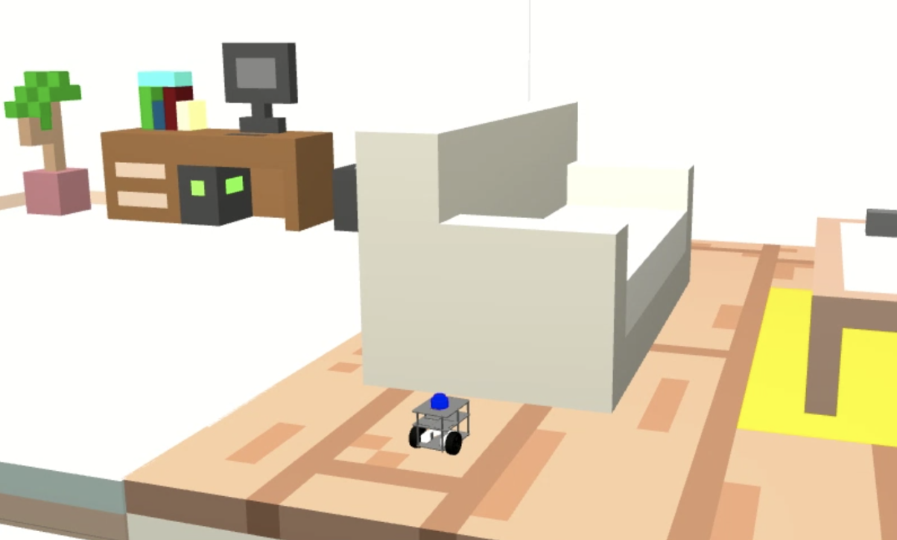
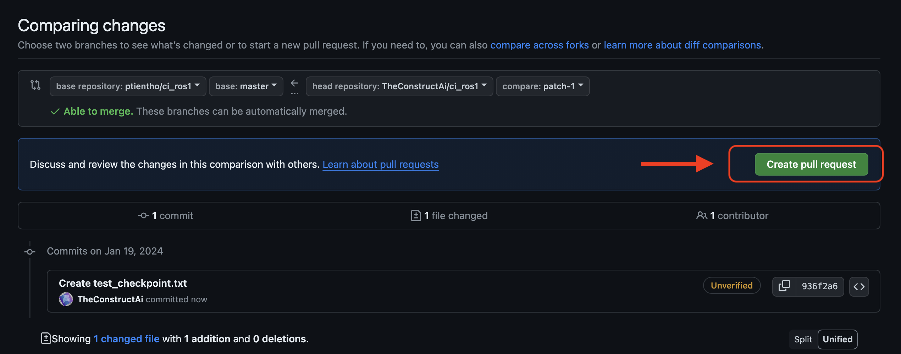

# Checkpoint 24 — `ros2_ci` (ROS 2 Continuous Integration)

Jenkins + Docker **Continuous Integration** pipeline for the **ROS 2 (Humble)** FastBot waypoints action server from Checkpoint 23. A Freestyle Jenkins job builds a purpose-built Docker image, launches **Gazebo headless** via **Xvfb**, starts the `fastbot_action_server`, runs the **GTest** node-level suite via `colcon test`, and reports pass/fail back to Jenkins. Triggered automatically whenever a new commit (or merged Pull Request) lands on `main`.

- **Repository under test**: `https://github.com/mathrosas/ros2_testing`
- **Packages**: `fastbot`, `fastbot_waypoints`
- **Tests**: C++ GTest via `colcon test` (final position + final yaw)

<p align="center">
  
</p>

## How It Works

1. **Jenkins** polls `https://github.com/mathrosas/ros2_ci` every minute (`* * * * *`) and triggers a build on new commits
2. **Docker build** — `Dockerfile` starts from `osrf/ros:humble-desktop`, installs Gazebo ROS 2 pkgs + `python3-colcon-common-extensions` + X11/Qt libs, clones `ros2_testing`, keeps only `fastbot` + `fastbot_waypoints` under `/ros2_ws/src`, and `colcon build --symlink-install`s the workspace
3. **Docker run** — `entrypoint.sh` starts Xvfb on `:1`, launches `fastbot_gazebo/one_fastbot_room.launch.py`, waits for the ROS 2 graph + `/fastbot_as` + `/fastbot/odom`, prints a debug goal/odom snapshot, and starts the action server
4. **Tests** — `colcon test --packages-select fastbot_waypoints` runs the GTest suite against the live sim, then `colcon test-result --verbose` dumps the summary
5. **Teardown** — kills the action server, `gzserver`, `gzclient`, and `Xvfb`; exits with the test result code so Jenkins marks the build red/green accordingly

## Project Structure

```
ros2_ci/
├── Dockerfile           # osrf/ros:humble-desktop + Gazebo + colcon + ros2_testing clone + colcon build
├── entrypoint.sh        # Xvfb → Gazebo → action server → colcon test → cleanup
├── run_jenkins.sh       # Helper: installs OpenJDK 17, downloads jenkins.war, launches Jenkins
├── media/
└── README.md
```

## Jenkins Setup

### Start Jenkins

```bash
bash run_jenkins.sh
```

The script sets `JENKINS_HOME=~/webpage_ws/jenkins/`, installs OpenJDK 17, downloads `jenkins.war`, and launches Jenkins in the background. The Jenkins URL and PID are written to `~/jenkins__pid__url.txt`.

Unlock with the initial admin password at `~/webpage_ws/jenkins/secrets/initialAdminPassword`, install suggested plugins, then log in with the lab credentials:

- **Username**: `admin`
- **Password**: `password`

> ⚠️ Lab-only credentials — do not reuse in any public or production environment.

### Create the job

1. **Dashboard → New Item → Freestyle project** — e.g. `ROS 2 CI – Fastbot Waypoints`
2. **Source Code Management → Git**
   - Repository URL: `https://github.com/mathrosas/ros2_ci`
   - Branches to build: `main`
3. **Build Triggers → Poll SCM**: `* * * * *`
4. **Build**: add the three shell steps below (each as a separate *Execute shell* step)

### Build steps (copy-paste)

**Step 1 — Preflight**

```bash
set -euxo pipefail
whoami && uname -a && docker --version && git --version && df -h

# allow Jenkins to talk to Docker (fine for a lab env)
sudo chmod 666 /var/run/docker.sock || true

docker image prune -f || true
docker container prune -f || true
```

**Step 2 — Build the CI image**

```bash
set -euxo pipefail
docker build --pull -t fastbot-ros2-ci \
  --build-arg REPO_URL=https://github.com/mathrosas/ros2_testing.git \
  --build-arg REPO_BRANCH=main \
  .
```

**Step 3 — Run the tests headless**

```bash
set -euxo pipefail
docker rm -f fastbot-ros2-ci >/dev/null 2>&1 || true
docker run --name fastbot-ros2-ci --rm --shm-size=2g -e CI=1 fastbot-ros2-ci
```

`--shm-size=2g` keeps Gazebo stable under headless rendering. No `-it` — Jenkins has no TTY.

## Local Quickstart (no Jenkins)

Sanity-check the image before wiring it into Jenkins:

```bash
docker build -t fastbot-ros2-ci \
  --build-arg REPO_URL=https://github.com/mathrosas/ros2_testing.git \
  --build-arg REPO_BRANCH=main \
  .

docker run --rm --shm-size=2g -e CI=1 fastbot-ros2-ci
```

Expected tail:

```
Summary: 1 package finished [~1min]
  1 package had test successes: fastbot_waypoints
* RESULT: SUCCESS
```

Exit code `0` = tests passed.

## Triggering a Build via Pull Request

1. In the `ros2_ci` GitHub repo, create or edit any file (e.g. `trigger.txt`), commit to a branch, open a Pull Request, and merge it into `main`
2. Within one minute, Poll SCM picks up the new commit and kicks off a Jenkins build
3. Watch the live logs via **Build History → #<n> → Console Output**

<p align="center">
  
</p>

## Prerequisites

- Ubuntu 22.04+ (or any Linux host with Docker + Java)
- **Docker Engine** (Jenkins user must be able to run `docker` — the preflight step `chmod 666`'s the socket as a shortcut)
- **OpenJDK 17** (installed by `run_jenkins.sh`)

Install Docker & enable non-root usage:

```bash
sudo apt-get update
sudo apt-get install -y docker.io docker-compose
sudo service docker start
sudo usermod -aG docker $USER
newgrp docker
```

## ROS 2 Middleware Defaults

The image pins:

```dockerfile
ENV ROS_DOMAIN_ID=1
ENV RMW_IMPLEMENTATION=rmw_cyclonedds_cpp
```

`rmw_cyclonedds_cpp` is more predictable than the default FastDDS inside Docker headless runs. Override with `-e RMW_IMPLEMENTATION=rmw_fastrtps_cpp` in the `docker run` step if your network needs it.

## Troubleshooting

### Docker permissions

If Jenkins can't reach Docker: `sudo chmod 666 /var/run/docker.sock` (lab shortcut) or add the Jenkins user to the `docker` group.

### Gazebo stuck / lingering `gzserver`

The entrypoint `pkill`s `gzserver` + `gzclient` on exit, but lingering processes on the host can still block the next run:

```bash
ps faux | grep gz
kill -9 <process_id>
```

<p align="center">
  
</p>

### DDS discovery fails inside Docker

If `/fastbot_as` or `/fastbot/odom` never shows up, double-check `ROS_DOMAIN_ID` and `RMW_IMPLEMENTATION` match between the sim and the action server (they do by default — both run inside the same container).

### Disk pressure

Docker images are heavy. The preflight step prunes dangling images/containers; run `docker system prune -af` occasionally on the host.

### TTY errors in Jenkins

Never add `-it` to `docker run` inside a Jenkins build — Jenkins has no controlling TTY.

## Key Concepts Covered

- **Jenkins Freestyle** job driven by shell steps (Dockerfile + entrypoint do the real work)
- **Headless Gazebo** via `Xvfb` + `DISPLAY=:1` + Qt/X11 tweaks (`QT_X11_NO_MITSHM=1`, `QT_XCB_GLUE_ALWAYS_IN_USE=1`)
- **Reproducible ROS 2 build** inside Docker — clone + `colcon build --symlink-install` baked into the image so every run starts from the same state
- **`colcon test` inside CI** — one executable (`fastbot_action_server`) shared between the sim + the GTest fixtures
- **CycloneDDS** as the RMW to avoid FastDDS discovery flakiness in containerized CI
- **Poll SCM** as a minimal "build on push / PR merge" trigger (no GitHub webhook required)

## Technologies

- Jenkins LTS (`jenkins.war`, OpenJDK 17)
- Docker Engine (`osrf/ros:humble-desktop` base image)
- ROS 2 Humble + Gazebo 11 (headless via `xvfb`)
- C++ 17 (`rclcpp`, `rclcpp_action`, `nav_msgs`, `geometry_msgs`, `tf2`)
- GTest via `ament_cmake_gtest`
